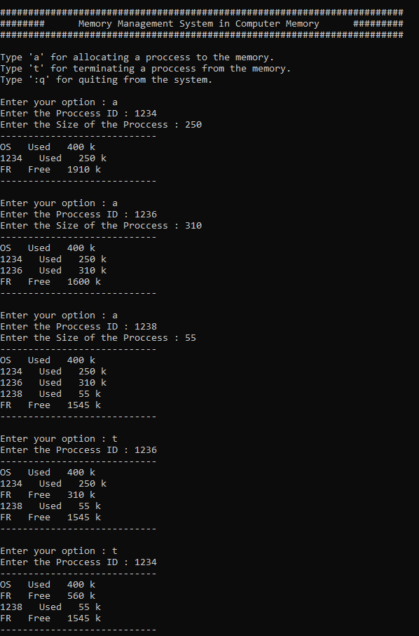

# POC - Memory Management System

This is the First-Fit algorithm used a proof of concept project of memory management system written in python3.

- There is fixed memory space of **400KB** for the Operating System.
- **2560KB** can be allocated for user processes.
- Allocating a process to memory and terminating a process from memory are the main functionalities provided in this POC.

OS - Operating System used  
FR - Free allocations

## Application Execution

